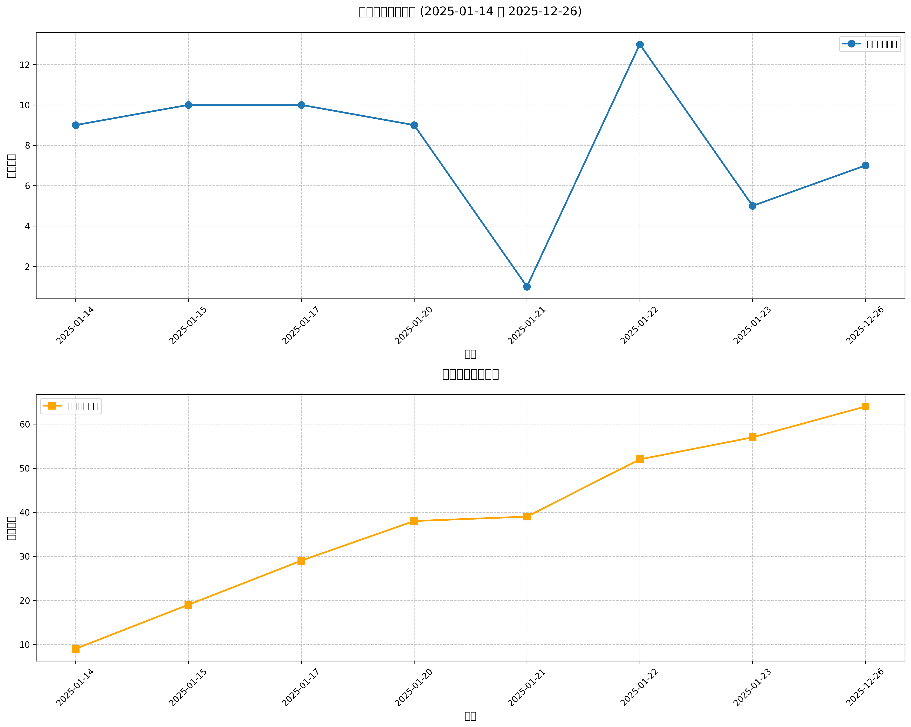

#  Hugging Face 2025-12-26 论文日报

## 📊 今日论文统计
- 总论文数：7
- 热门领域：RL, GPT

## 📝 论文详情

### 1. 潜在隐式视觉推理

**原文标题：** Latent Implicit Visual Reasoning

**摘要：**
尽管大型多模态模型（LMMs）取得了显著进展，但它们仍然主要以文本为中心，依赖语言作为核心推理方式。因此，它们在处理以视觉为主的推理任务时能力有限。近期的方法试图通过使用辅助图像、深度图或图像裁剪来监督中间视觉步骤。然而，这些策略对“有用”视觉抽象的定义施加了限制性先验，增加了繁重的标注成本，并难以在任务之间进行泛化。为了解决这一关键限制，我们提出了一种与任务无关的机制，训练LMMs在没有显式监督的情况下发现和使用视觉推理标记。这些标记以全局方式关注并以任务自适应的方式重新编码图像，使模型能够提取相关的视觉信息，而无需手工制作的监督。我们的方法超越了直接微调，并在多样化的视觉中心任务上取得了最先进的成果——包括那些难以具体化中间抽象的任务，同时也能在多任务指令调优中实现泛化。

**论文链接：** [HuggingFace](https://huggingface.co/papers/2512.21218) | [arXiv](https://arxiv.org/abs/2512.21218)

---

### 2. 自回归模型中的新兴时间抽象促进层次强化学习

**原文标题：** Emergent temporal abstractions in autoregressive models enable hierarchical reinforcement learning

**摘要：**
在基于下一个标记预测进行预训练并通过强化学习（RL）进行微调的大规模自回归模型取得了前所未有的成功，涵盖了许多问题领域。在强化学习过程中，这些模型通过逐个生成新的输出进行探索。然而，逐个标记采样行为可能导致学习效率低下，特别是在奖励稀疏的情况下。在此，我们展示了通过在自回归模型的内部表征中进行行动和探索可以克服这一问题。具体而言，为了发现时间抽象的行为，我们引入了一种高阶非因果序列模型，其输出控制基础自回归模型的残差流激活。在具有层次结构的网格世界和基于MuJoCo的任务中，我们发现高阶模型学会将长激活序列块压缩到内部控制器。关键在于，每个控制器执行一系列在长时间尺度上展开的具有行为意义的动作，并伴随学习到的终止条件，从而使得在时间上组合多个控制器能够在新任务上实现高效的探索。我们表明，直接的内部控制器强化过程，即我们称之为“内部强化学习”，使得在标准强化学习微调失败的情况下能够从稀疏奖励中学习。我们的结果证明了在自回归模型中潜在动作生成和强化学习的好处，建议内部强化学习作为在基础模型中实现层次强化学习的有希望的途径。

**论文链接：** [HuggingFace](https://huggingface.co/papers/2512.20605) | [arXiv](https://arxiv.org/abs/2512.20605)

---

### 3. Spatia：具有可更新空间记忆的视频生成

**原文标题：** Spatia: Video Generation with Updatable Spatial Memory

**摘要：**
现有的视频生成模型在保持长期空间和时间一致性方面面临困难，这主要是由于视频信号的稠密和高维特性。为了解决这一限制，我们提出了Spatia，一个关注空间记忆的视频生成框架，该框架明确地将三维场景点云视为持久的空间记忆。Spatia通过依赖于这一空间记忆迭代生成视频片段，并通过视觉惯性导航（SLAM）不断更新此记忆。这种动态-静态解耦设计在整个生成过程中增强了空间一致性，同时保留了模型生成真实动态实体的能力。此外，Spatia还支持显式相机控制和三维感知交互编辑等应用，为可扩展的、基于记忆的视频生成提供了几何基础框架。

**论文链接：** [HuggingFace](https://huggingface.co/papers/2512.15716) | [arXiv](https://arxiv.org/abs/2512.15716)

---

### 4. 舍恩费尔德的语言模型数学推理解剖学

**原文标题：** Schoenfeld's Anatomy of Mathematical Reasoning by Language Models

**摘要：**
大型语言模型越来越多地展现出推理轨迹，但其潜在的认知结构和步骤仍然难以识别和分析，超出了表层统计的范围。我们采用舍恩费尔德的情节理论作为一种归纳的、中等规模的视角，并引入ThinkARM（模型推理的解剖学），这是一种可扩展框架，能够将推理轨迹明确地抽象为功能性推理步骤，如分析、探索、实现、验证等。应用于多种模型的数学问题解决时，这种抽象揭示了可重复的思维动态以及推理模型与非推理模型之间的结构差异，而这些在符号级别的视角中并不明显。我们进一步提供了两项诊断案例研究，显示探索作为一个与正确性相关的关键分支步骤，其效率导向的方法选择性地抑制评估反馈步骤，而非统一缩短回应时间。总之，我们的研究结果表明，情节级别的表示使推理步骤明确化，从而能够系统地分析现代语言模型中推理是如何构建、稳定和改变的。

**论文链接：** [HuggingFace](https://huggingface.co/papers/2512.19995) | [arXiv](https://arxiv.org/abs/2512.19995)

---

### 5. 视频基础模型在多大程度上编码三维信息？

**原文标题：** How Much 3D Do Video Foundation Models Encode?

**摘要：**
视频是三维世界的连续二维投影。在对大规模视频数据进行训练后，全球的三维理解是否会自然而然地出现？我们通过量化现有视频基础模型（VidFMs）在海量视频数据上预训练后的三维理解能力来研究这个问题。我们提出了第一个模型无关的框架，通过浅层读取方式从特征中估计多个三维属性来衡量各种VidFMs的三维意识。我们的研究在多个维度上提供了有关VidFMs三维意识的有意义发现。特别是，我们展示了最先进的视频生成模型尽管没有在任何三维数据上进行训练，却展现出对三维物体和场景的强烈理解。这种理解甚至可以超过专门为三维任务训练的大型专家模型。我们的发现连同主要VidFMs的三维基准测试，为构建可扩展的三维模型提供了宝贵的观察。

**论文链接：** [HuggingFace](https://huggingface.co/papers/2512.19949) | [arXiv](https://arxiv.org/abs/2512.19949)

---

### 6. VA-π：针对像素感知自回归生成的变分策略对齐

**原文标题：** VA-π: Variational Policy Alignment for Pixel-Aware Autoregressive Generation

**摘要：**
自回归（AR）视觉生成依赖于令牌器将图像映射至离散序列。然而，令牌器的训练目标是从真实令牌重构干净的图像，而AR生成器仅针对令牌的似然性进行优化。这种不对齐导致生成的令牌序列可能解码成低质量图像，且缺乏来自像素空间的直接监督。我们提出了VA-π，一个轻量级的后期训练框架，旨在通过一个有原则的像素空间目标来直接优化AR模型。VA-π将生成器与令牌器的对齐形式化为变分优化，推导出一个证据下界（ELBO），统一了像素重构和自回归建模。为了在离散令牌空间中进行优化，VA-π引入了一种基于强化学习的对齐策略，将AR生成器视为一种策略，并使用像素空间的重构质量作为其内在奖励。奖励通过预测的令牌序列在教师引导下重构原始图像的效果来衡量，从而为模型提供像素级的直接指导，而无需昂贵的自由运行采样。ELBO的正则化项作为一种自然的正则化器，保持令牌的分布一致性。VA-π使现有AR生成器能够快速适应，无需重新训练令牌器或外部奖励模型。在仅使用1%的ImageNet-1K数据和25分钟的微调后，FID从14.36降低到7.65，IS从86.55提高到116.70，同时在GenEval的文本到图像任务中，对于视觉生成模型（LlamaGen：从0.306提升至0.339）和统一多模态模型（Janus-Pro：从0.725提升至0.744）也取得了显著的进展。代码可在https://github.com/Lil-Shake/VA-Pi获取。

**论文链接：** [HuggingFace](https://huggingface.co/papers/2512.19680) | [arXiv](https://arxiv.org/abs/2512.19680)

---

### 7. GTR-Turbo：合并检查点秘密地成为代理性视觉语言模型训练的“免费”教师

**原文标题：** GTR-Turbo: Merged Checkpoint is Secretly a Free Teacher for Agentic VLM Training

**摘要：**
基于视觉语言模型（VLM）的多模态智能体的多回合强化学习（RL）受到稀疏奖励和长期信用分配的限制。近期的方法通过查询提供逐步反馈的教师（例如，导向思维增强（GTR）和在政策蒸馏），增加奖励密度，但通常依赖成本高昂且往往是特权模型作为教师，这限制了其实用性和可重复性。我们提出了GTR-Turbo，这是一种GTR的高效升级，它在无需训练或查询昂贵教师模型的情况下，达到相同的性能。具体而言，GTR-Turbo合并了在进行中的RL训练中生成的检查点的权重，然后使用该合并模型作为一个“免费”教师，通过监督微调或软逻辑蒸馏来指导后续的RL。这一设计消除了对特权VLM（例如，GPT或Gemini）的依赖，减轻了先前研究中观察到的“熵崩溃”现象，并保持训练的稳定性。在各种视觉代理任务中，GTR-Turbo将基线模型的准确性提高了10-30%，同时将壁钟训练时间减少了50%，计算成本相较于GTR降低了60%。

**论文链接：** [HuggingFace](https://huggingface.co/papers/2512.13043) | [arXiv](https://arxiv.org/abs/2512.13043)

---

## 🔍 关键词云图

## 📈 近期论文趋势

## 🎙️ 语音播报
- [收听今日论文解读](../audio/2025-12-26_daily_papers.mp3)

## 📱 订阅渠道
- GitHub: [hf-daily-paper-newsletter-chinese](https://github.com/2404589803/hf-daily-paper-newsletter-chinese)